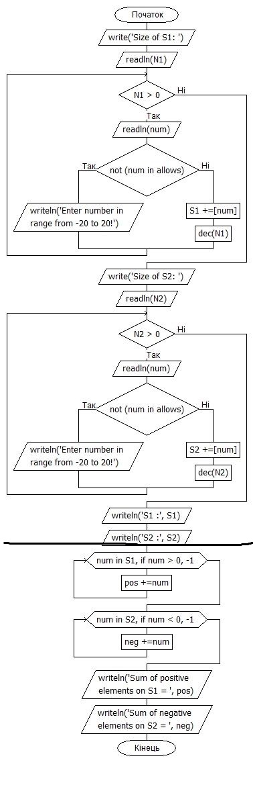

# lab1

- git clone https://gitlab.com/Normalstrafe/lab1.git
- git commit -m "Lab_1 (first commit)" c6a26263219d74693e3bec4cf6d92e31d007ffe8
- git checkout new-branch
- Було видалено зайві строки у документі для усунення конфлікту
- 9.жодних змін немає
- 9.Git pull
-

