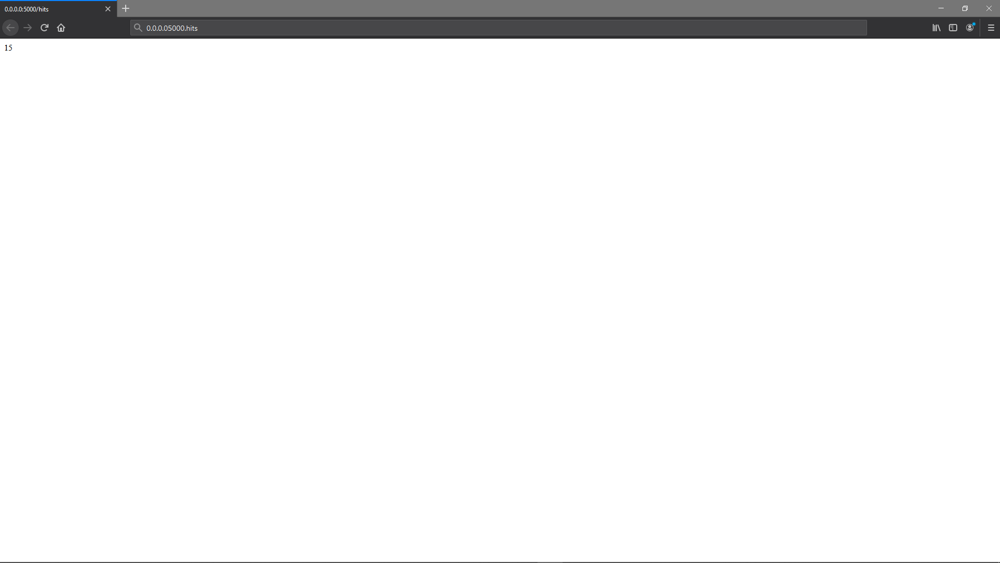
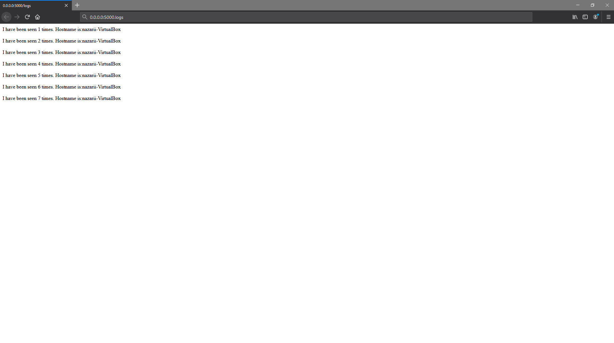

***Lab_5***

***1***
```
Створюю папки my_app та tests
```
***2***
```
Виконую наступні команди
    - pipenv --python 3.7
    - pipenv install -r requirements.txt
    - pipenv run python app.py
```
***3***
```
Використовую команду pipenv run pytest test_app.py --url http://localhost:5000
Нічого не вийшло
Встановлюю Redis  через команду  sudo apt install redis-server та команду sudo nano /etc/redis/redis.conf 
Після чого все начебто почало працювати
```
***4***
```
Видаляю та добавляю в ignore відповідні файли ( для зручності просто використовую команду git add --all, більше не буду;)
```
***5***
```
    - test-app містить мету запуску, запускає тести)
    - .phony - трішки важко було розібратися, з того,що зрозумів - це "інструмент" для фальшивих цілей, які працюють незалежно від файлової системи
    - docker prune - видаляє усі контейнери, мережі та Images
    - run запускає redis, тв створює мережу
```
***6***
```
за допомогою наступних команд запускаю тести та мережу
    - sudo make app tests
    - sudo make run
    - sudo make test-app
```
***7***
```



```
***8***
```
Щоб запушити було використано
    - sudo docker-prune
    - sudo make docker-push
```
**9**
```
Створюю docker-compose.yaml, та заповнюю його по прикладу. Пояснення чому розгортаються дві мережі:
    -    Перша для взаємодії з сайтом
    -   Друга для Redis
```
***10***
```
Використовую команду docker-compose version
docker-compose -p lab_5 up
чищу ресурси docker-compose down
```
***11***
```
Завантажую створені імеджі 
    -   docker-compose push
```
***12***
```
Makefile є зручнішим як на мене, до того ж я не знайшов як через другий спосіб очищати контейнери та зображення
```
***13***
```
Створюю compose для 4 лабораторної роботи
```

P.S команди можуть трішки відрізнятися, так як README заповнялося вже після виконання лабораторної роботи (на вінді у IntelliJIdea набагато зручніше)
, а команд, до прикладу щоб запустити середовще для тестів було використано ьагато по кілька разів,  в різній послдовності
поки не була знайдена ця: sudo apt install redis-server
